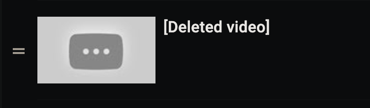

# backup-youtube-playlists
*tool that backs up your youtube playlists*

## Problem Statement
YouTube playlists are subject to change! Videos can be taken down for a whole host of reasons. Unfortunately, there is never information available for what those videos in your playlist were. **All you see is the following:**
 

This project was created to allow users with a link to any ```Public``` or ```Unlisted``` YouTube playlists to be able to backup those playlist locally on their own machines, so they never have to wonder about the state of any YouTube playlists that they enjoy. 

## What this tool does
Under the ```Releases``` page you will find 2 executables (one made for macOS, one for Windows) that serve as a command line utility that will back up every playlist whose link is provided in a .txt file

This tool will generate the following items:
```
1. a folder called 'saved-playlists' which will contain folders for each backup-up playlist 
2. sub folders for each playlist listed 
3. a file called <playlist name>_MASTER.txt which is the file that contains the list of videos belonging to <playlist name>
4. a folder for every video in each playlist, placed in the appropriate playlist folder that video belongs to

Each video folder contains 3 items:
1. <video name>.info.json -> a meta data file containing details about the video like the description, uploader, upload date, e.t.c.
2. <video name>.jpg/<video name>.webp -> the thumbnail of the video (sometimes the format will be .jpg or .webp depending on what's available for the given video
3. <video name>.mp4 -> the actual video file itself
```

Once you've run the ```backup-youtube-playlists``` executable, you can run it again at anytime in the same location and the tool will automatically update your backed up playlist folders with any new videos that have been added to those playlists since the last time you backed them up

## What you need to run
1. ```youtube-dl```, which you can find at https://ytdl-org.github.io/youtube-dl/download.html
2. ``python``version 2.6, 2.7, or 3.2+ except if your running on Windows
3. ```backup-youtube-playlists``` executable found in the ```Releases``` page
4. a ```.txt``` file that lists the urls of the playlists you want backed up

## execution flow for using the executable release
1. download ```youtube-dl``` and add it to your $PATH
2. save the ```backup-youtube-playlists``` executable specific to your system, add it to your $PATH
4. create a .txt file that contains the links to the playlists you want to backup
5. navigate to where you would like the backed up playlist(s) to be located (for step 6 i'll call this file playlists.txt)
6. run ```$backup-youtube-playlists <path to playlists.txt>```
7. you should see some output in your console regarding the progress of the playlists downloads

#### *the duration the script will run for depends on how many videos are in each playlist as well as the length of each video in the playlist*

## example execution
assume I have downloaded ```youtube-dl```, the executable ```backup-youtube-playlists```, have added both to my $PATH, and have created a file ```playlists.txt``` which contains two links
> https://www.youtube.com/playlist?list=PLD5tdhS33Hf3HwerBm9iDoIjjOuZjoVkv -> a public playlist called 'basketball-highlights', contains 1 video 
>  
> https://www.youtube.com/playlist?list=PLD5tdhS33Hf3HwerBm9iDoIjjOuZjoVkv -> a public playlist called 'funny videos', contains 1 video

*contents of ```playlists.txt```*
```
https://www.youtube.com/playlist?list=PLD5tdhS33Hf3HwerBm9iDoIjjOuZjoVkv 
https://www.youtube.com/playlist?list=PLD5tdhS33Hf3HwerBm9iDoIjjOuZjoVkv
```

Now I run the following command in the same directory of ```playlists.txt```
```bash
$backup-youtube-playlists playlists.txt
```

After the executable finishes running, I can now expect the following folder structure to be created 
```
saved-playlists/
├─ basketball-highlights/
│  ├─ 1987 NBA All-Star Game/
│  │  ├─ 1987 NBA All-Star Game.jpg
│  │  ├─ 1987 NBA All-Star Game.mp4
│  │  ├─ 1987 NBA All-Star Game.info.json
│  ├─ basketball-highlights_MASTER.txt
├─ funny videos/
│  ├─ Charlie bit my finger (Original upload)/
│  │  ├─ Charlie bit my finger (Original upload).info.json
│  │  ├─ Charlie bit my finger (Original upload).mp4
│  │  ├─ Charlie bit my finger (Original upload).webp
│  ├─ funny videos_MASTER.txt

```

## What to expect for the future of this tool
- A GUI will be produced in the future to more easily manage backed up playlists
- More fine-grained control on how the tool functions (choosing to not download videos of a certain size, choosing to only grab info.json, choosing to only download thumbnails)
